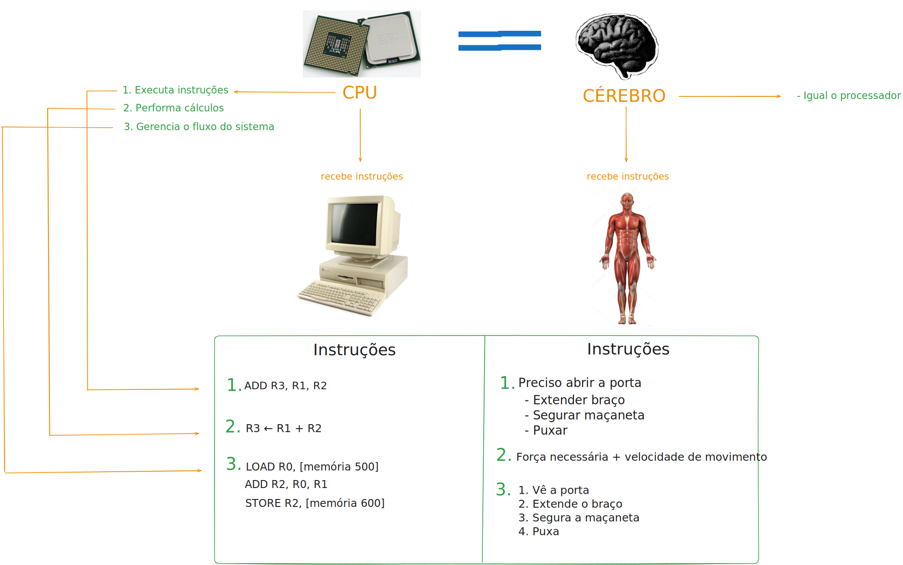
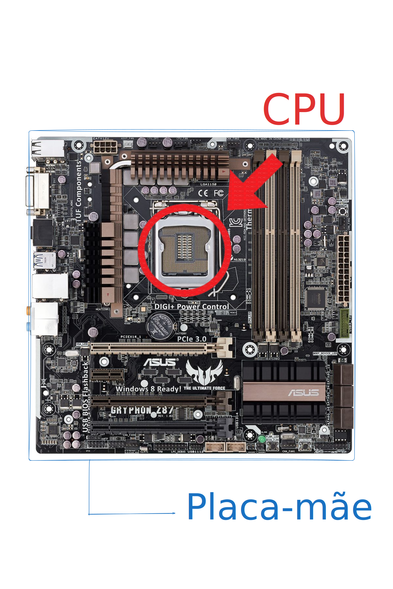
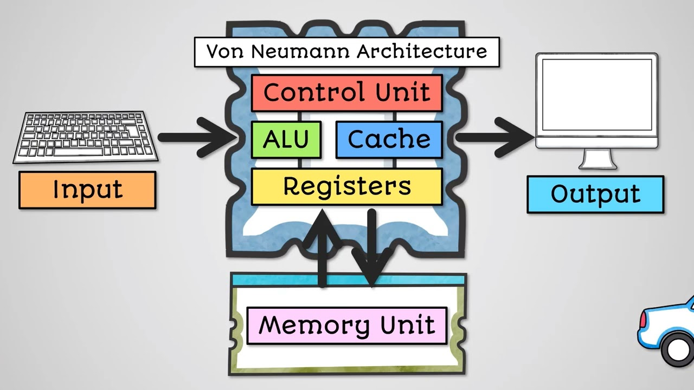

# 📖 CPU 

**Data:** 21/01/2026  
**Fase:** PRÉ-ROADMAP  
**Status:** 🔄 Em andamento  
**Tempo de Estudo:** 68 min

## ⚙️Recursos
Link 01: https://roadmap.sh/ai/course/information-technology-it-fundamentals
Link 02: https://youtu.be/IEYFlGLAhyo
## 📚 Índice

## 📝 Resumo Rápido
A CPU (Central Processing Unit) se comporta como um cérebro para o computador.
#### O que faz + Analogia
Executa, Performa cálculos 

Link: https://excalidraw.com/#json=S_tR54hvZgY5EnhKMhr2k,ww-jMAxHlU3AT8v5hs18Xw

## 🔍 Conceito Principal 1

### O que é?

> CPU é um componente do computador capaz de executar todas instruções que rodam no sistema.

Localizado dentro da Placa-mãe: 

Link: https://excalidraw.com/#json=SKBk1p5zOQqXdnva9J0OK,OyJrS0cLUhLS601JTQw58g
### Como funciona?

> A CPU contém diversos componentes dentro dela, de maneira geral seu trabalho é:
> Receber um **Input** (Entrada) de algum dispositivo conectado no computador, fazer certos cálculos e retornar um **Output** (Saída) para outro dispositivo

Imagem retirada do vídeo: https://www.youtube.com/watch?v=IEYFlGLAhyo

Entenda a arquitetura de Von Neumann aqui: https://www.youtube.com/shorts/0IadYIIgrMI

## 🧠 Componentes da CPU
### 🔹 ALU — Arithmetic Logic Unit
- **Função:**  
  Realiza operações aritméticas e lógicas (AND, OR, XOR).
- **Analogia:**  
  🖐️ Mão: executa o trabalho direto.

---
### 🔹 CU — Control Unit
- **Função:**  
  Controla o que fazer e quando fazer.
- **Analogia:**  
  📜 Livro de receitas: decide os passos.

---
### 🔹 Registers
- **Função:**  
  Armazenam os dados que estão sendo usados no momento.
- **Analogia:**  
  🍯 Pote: acesso rápido.

---
### 🔹 Cache
- **Função:**  
  Memória rápida que guarda dados usados recentemente.
- **Analogia:**  
  🧄🧅🫚🌶️ Ingredientes e temperos sempre à mão e frequentemente utilizados.

---
### Ciclo Fetch-Decode-Execute
É um processo que a CPU usa para rodar programas de maneira continua bilhões de vezes por segundo.

```
FETCH -> DECODE -> EXECUTE -> STORE

1️⃣FETCH (Buscar):
 └─ Central Unit busca a instrução na memória

2️⃣DECODE (Decodifica):
 └─ Central Unit entende o que a instrução quer fazer
 
3️⃣EXECUTE (Executa):
 └─ Central Unit realiza a operação
 
4️⃣STORE (Guardar):
 └─ Resultado volta para a memória/registers
```
Entenda melhor aqui: https://youtu.be/Z5JC9Ve1sfI

---
### Clock = Velocidade
3.6 GHz = 3.6 bilhões de ciclos por segundo.

Quanto mais rápido + operações por segundo

---
### Núcleos/Cores
Quanto mais cores, mais instruções por vez:

- **Single-core (1 núcleo):**
  - Executa 1 instrução por vez
  - Exemplo: CPU anos 2000

- **Dual-core (2 núcleos):**
  - Executa 2 instruções por vez
  - Mais rápido que Single-core

- **Quad-core (4 núcleos):**
  - Executa 4 instruções em paralelo
  - Computadores mais modernos
  
> Quanto mais cores + cérebros seu CPU possui.

---
### Exemplos de CPUs

INTEL:
- Core i3 → 2-4 núcleos (básico)
- Core i5 → 4-8 núcleos (comum)
- Core i7 → 8-16 núcleos (PC gamer)
- Core i9 → 16-24 núcleos (workstation)

AMD:
- Ryzen 5 → 4-6 núcleos (comum)
- Ryzen 7 → 8-16 núcleos (dev)
- Ryzen 9 → 12-24 núcleos

### 🔐 Por que importa em Segurança?
Ainda não sei rs.